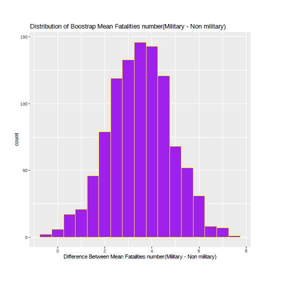

<!DOCTYPE HTML>
<!--
	Miniport by HTML5 UP
	html5up.net | @ajlkn
	Free for personal and commercial use under the CCA 3.0 license (html5up.net/license)
-->
<html>
	<head>
		<title>Miniport by HTML5 UP</title>
		<meta charset="utf-8" />
		<meta name="viewport" content="width=device-width, initial-scale=1, user-scalable=no" />
		<link rel="stylesheet" href="assets/css/main.css" />
	</head>
	<body class="is-preload">

		<!-- Nav -->
			<nav id="nav">
				<ul class="container">
					<li><a href="#top">Top</a></li>
					<li><a href="#portfolio">Portfolio</a></li>
					<li><a href="#contact">Contact</a></li>
				</ul>
			</nav>
		<!-- Home -->
			<article id="top" class="wrapper style1">
				

					

						

							
						

						

							<header>
								<h2><strong>Hi! I'm</strong> Laura Assylgazhina</h2>
							</header>
							
I thrive on the challenges of data manipulation, visualization, statistical analysis,
							and bring valuable expertise as a seasoned business analyst  
							<a href="https://www.linkedin.com/in/laura-assylgazhina/" class="icon brands fa-linkedin-in" style="font-size: 16px; margin-right: 4px;">LinkedIn</a>
							<a href="https://github.com/LauraAnalyst" class="icon brands fa-github" style="font-size: 16px; margin-right: 4px;">Github</a>
							<a href="mailto:zhanayla@gmail.com" class="icon brands fa-google-plus" style="font-size: 16px; margin-right: 4px;">Google+</a>
						

						
							<a href="#portfolio" class="flat-button" style="background-color: #996699; color: #ffffff; border-radius: 6px; padding: 18px 30px; text-decoration: none; font-weight: bold;">My projects</a>
						

					

				

			</article>

		
		<!-- Portfolio -->
			<article id="portfolio" class="wrapper style3">
				

					<header>
						<h2>Here’s some stuff I made recently.</h2>
						
Explore the projects I have undertaken, demonstrating my expertise

					</header>
					

						

							<article class="box style2">
								
								<h3><a href="https://lauraanalyst.github.io/311-Service-Requests-Analysis/">Exploring Calgary's 311 Service Requests</a></h3>
								
An engaging Python-based interactive data story uncovering urban insights through visualizations created in Plotly, Bokeh, and Matplotlib

							</article>
						

						

							<article class="box style2">
								
								<h3><a href="https://rpubs.com/zhanayla/1056764">CO2 Emissions in Fuel Vehicles</a></h3>
								
In this R-based project, we utilized Logistic Regression, Discriminant Analysis, Decision Tree, and Multinomial Regression to identify the models

							</article>
						

						

							<article class="box style2">
								
								<h3><a href="#">Linear regression for Stock Price</a></h3>
								
An R-based project using multiple linear regression to analyze the impact of selected factors on stock prices of National Bank of Canada

							</article>
						

						

							<article class="box style2">
								
								<h3><a href="#">Comparing Military and Non-military Aircraft Accidents</a></h3>
								
R-based Statistical analysis explored fatalities in military and non-military accidents, estimated proportions, and examined the relationships

							</article>
						

						

							<article class="box style2">
								
								<h3><a href="#">CityRank: Analyzing Factors for the Ideal City to Live in Canada</a></h3>
								
We utilized Python and SQLAlchemy to analyze a range of economic, environmental, and social factors in order to determine the ideal city to reside in within Canada

							</article>
						

						

							<article class="box style2">
								
								<h3><a href="#">Datathon  Contributions</a></h3>
								
Leveraging Python for engaging in exploratory data analysis, time series analysis, statistical methods, and textual analysis challenges during various datathons

							</article>
						

					

					<footer>
						
						<a href="#contact" class="flat-button" style="background-color: #996699; color: #ffffff; border-radius: 6px; padding: 18px 30px; text-decoration: none; font-weight: none;">Get in touch with me</a>
					</footer>
				

			</article>

		<!-- Contact -->
		<article id="contact" class="wrapper style4">
							<h3>Find me on ...</h3>
							<ul class="social">
								<li><a href="https://www.linkedin.com/in/laura-assylgazhina/" class="icon brands fa-linkedin-in">LinkedIn</a></li>
								<li><a href="https://github.com/LauraAnalyst" class="icon brands fa-github">Github</a></li>
								<li><a href="mailto:zhanayla@gmail.com" class="icon brands fa-google-plus">Google+</a></li>
								<!--
								<li><a href="#" class="icon solid fa-rss">RSS</a></li>
								<li><a href="#" class="icon brands fa-instagram">Instagram</a></li>
								<li><a href="#" class="icon brands fa-foursquare">Foursquare</a></li>
								<li><a href="#" class="icon brands fa-skype">Skype</a></li>
								<li><a href="#" class="icon brands fa-soundcloud">Soundcloud</a></li>
								<li><a href="#" class="icon brands fa-youtube">YouTube</a></li>
								<li><a href="#" class="icon brands fa-blogger">Blogger</a></li>
								<li><a href="#" class="icon brands fa-flickr">Flickr</a></li>
								<li><a href="#" class="icon brands fa-vimeo">Vimeo</a></li>
								-->
							</ul>
							

						

					

					<footer>
						<ul id="copyright">
							<li>&copy; Laura Assylgazhina</li><li>Design: <a href="http://html5up.net">HTML5 UP</a></li>
						</ul>
					</footer>
				

			</article>

		<!-- Scripts -->
			
			
			
			
			
			

	</body>
</html>
